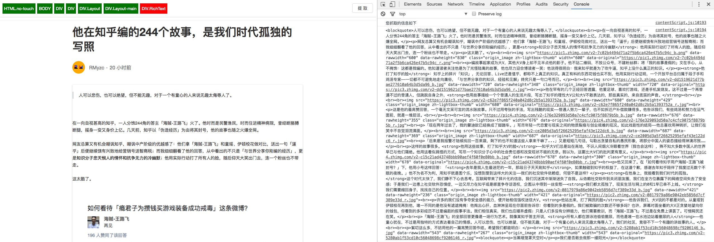

# 网页过滤器

用于抽取网页中你需要的信息，然后保存到你喜欢的任何地方。

### 使用方法

```bash
# 安装依赖
yarn install

# 运行
yarn start 

# 代码生成
yarn build
```
## 目录结构

- dist
    代码生成文件夹，所有插件的代码都会生成到dist目录下，如果需要调试，请打开chrome开发者模式，然后手动添加本地插件目录到此文件夹

- out
    插件生成目录，插件会生成到这个目录

- script
    一些脚本工具

- src
    开发目录

## 演示


## 注意

`/Applications/Google Chrome.app/Contents/MacOS/Google Chrome`

> 注意你的chrome是不是在此路径下，如果有出入，请修改script/chrome-pack.js文件

### 支持

- github: [XueRainey](https://github.com/XueRainey)
- Email: [xuebing_orz@icloud.com](mailto:xuebing_orz@icloud.com)
- [Personal blog](http://www.rainey.space/)

