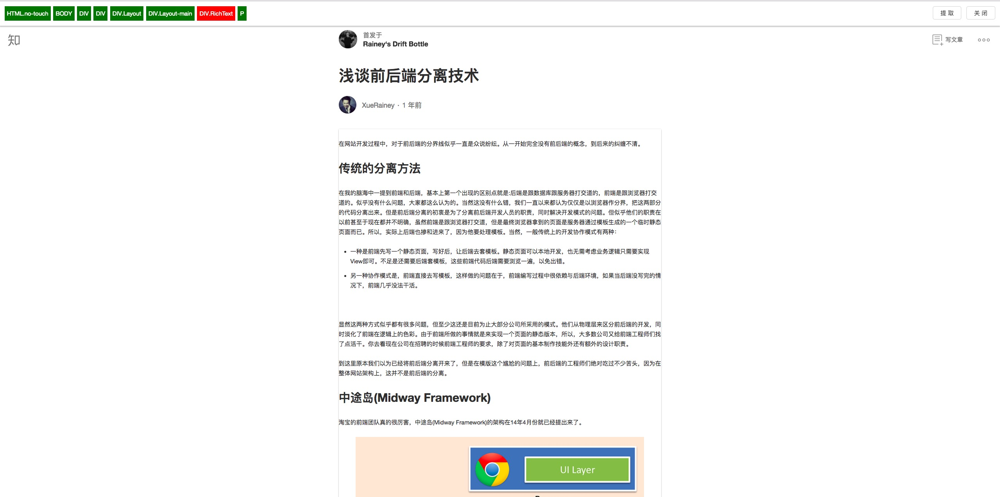

----

# x-draw-to-bear

本项目本意是想做一款能够用户手动控制抓取内容的插件，考虑过将生成内容转存到服务器生成rss订阅，所以`_src`内版本是基于rss服务的实现代码。

而后发现`Url Scheme`可以实现存储内容，然后就试着用了一下Bear，然后感觉效率比通过冗杂的rss服务要强大的多，我做这款插件的初衷本是为了能精确控制这些稍后阅读类的信息。未来会将`Url Scheme`通过设置的模式开放。

### 构建方法

```bash
# 安装依赖
yarn install

# 运行
yarn start 

# 代码生成
yarn build
```
## 目录结构

- dist
    代码生成文件夹，所有插件的代码都会生成到dist目录下，如果需要调试，请打开chrome开发者模式，然后手动添加本地插件目录到此文件夹

- out
    插件生成目录，插件会生成到这个目录

- script
    一些脚本工具

- _src
    旧的支持rss服务的版本，废弃

- src
    开发目录

## 演示


----
抓取结果


## 注意

`/Applications/Google Chrome.app/Contents/MacOS/Google Chrome`

> 注意你的chrome是不是在此路径下，如果有出入，请修改script/chrome-pack.js文件

### 支持

- github: [XueRainey](https://github.com/XueRainey)
- Email: [xuebing_orz@icloud.com](mailto:xuebing_orz@icloud.com)
- [Personal blog](http://www.rainey.space/)

